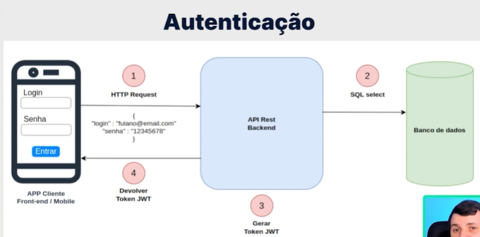
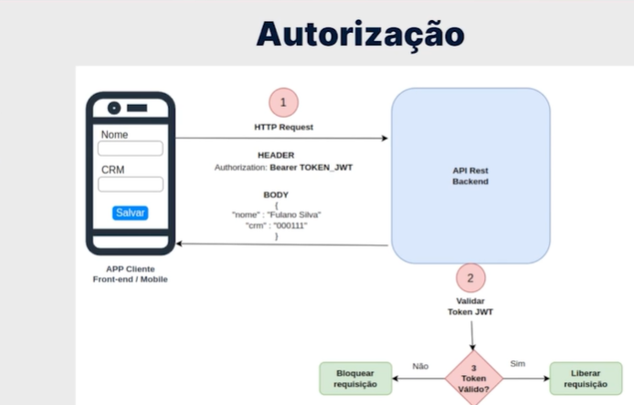
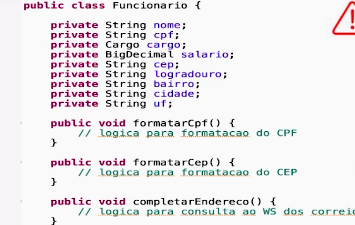

## Voli API

> É um exemplo fictício de backend (API RestFull) para uma instituição médica. Criada com intuito de desenvolver
> conhecimento sobre SpringBoot

### Spring Security

- Autenticação
- Autorização (controle de acesso)
- Proteção contra ataques (CSRF, clickjacking, etc.)

#### Autenticação em aplicação Web **(Statefull)**

> Toda vez que um usuário faz login, a aplicação guarda o estado do usuário atual.
> Criando "sessões" para que o usuário seja identificado nas próximas requisições

#### Autenticação em API Rest **(Stateless)**

> O cliente deve se identificar a cada requisição, não há "sessão/dados" armazenados no
> servidor.

### Coesão

- União harmónica entre uma coisa e outra
- Classe: coisas que estão dentro das classes, os atributos e métodos devem ter harmonia
- Uma classe não coesa seria uma classe com muitos atributos e responsábilidades
- 

### Encapsulamento

- Incluir ou proteger algo em uma cápsula
- Blindar
- Proteger uma classe contra influência, manipulações, externas que podem prejudicar a consistência das informações
- Encapsulamento não é só declarar atributos privados e criar getter e setter

### Acoplamento

- Ação de acoplar: agrupamento aos pares

- Na prática, é quando dois compenentes estão trabalhando em conjunto, como uma classe que faz a
  utilização de outra. Mas não necessáriamente o acoplamento é ruim.
- Porém, o ideal é que o acoplamento não seja forte, de tal forma que, uma mudança na classe B,
  sendo utlizada pela classe A, não causa impacto.

#### Extrair Classe

* Extrair um comportamento de uma classe para uma classe dedicada a isto
* Single Responsibility Principle

## S.O.L.I.D: Os 5 princípios da POO

1. S — Single Responsiblity Principle (Princípio da responsabilidade única)
    * Uma classe deveria ter apenas um único motivo para mudar Robert (Uncle Bob) Martin
    * 
2. O — Open-Closed Principle (Princípio Aberto-Fechado)
    * adicionar novos comportamentos sem ter que alterar o código da classe
    * entidade d software (classes, módulos, funções) devem estar abertas para extensão,
    * porém, fechadas para modificação -- Bertrand Meyer
    * 
3. L — Liskov Substitution Principle (Princípio da substituição de Liskov)
    * 
    * Composição como alternativa a herança
4. I — Interface Segregation Principle (Princípio da Segregação da Interface) 
    * Uma classe não deveria ser forçada a depender de métodos que não utilizará 
    * -- Uncle Bob
    * 
5. D — Dependency Inversion Principle (Princípio da inversão da dependência)
    * Abstrações não devem depender de implementações.
    * Implementações devem depender de abstrações. -- Robert (Uncle Bob) Martin

